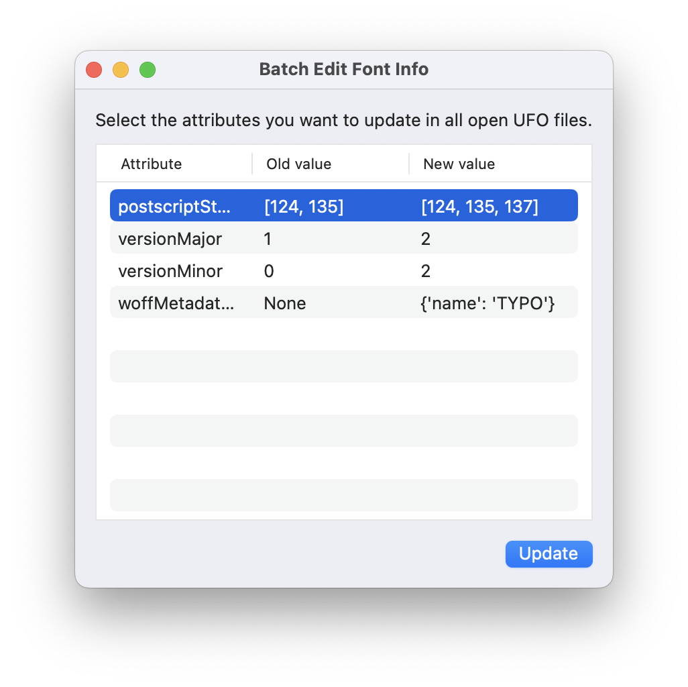
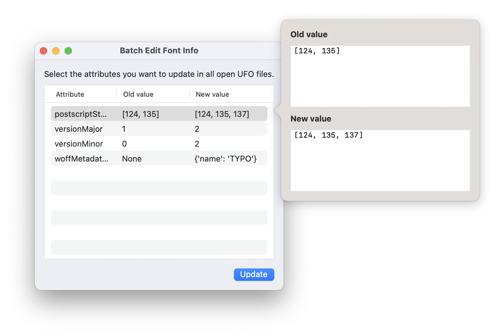

Font Info Batch Editor
==========

A RoboFont extension that listens to changes made to a font's info, and then allows you to replicate them across open UFO files.

Installation
------------

Download and double-click the `.roboFontExt` file in the Releases section to install <!--manually, or get it via [Mechanic2](http://robofontmechanic.com/).-->

When installed, the FontInfoBatchEditor window becomes available from the _Extensions_ menu.

Usage
-----

- Open the Font Info Batch Editor window
- Edit your font's info
- The changes appear in the UI, but you can still make new ones. You can double click on a row to see the full info text, and a comparison between the old and the new value
- Replicate the changes across all open UFO files by clicking the *Update* button

